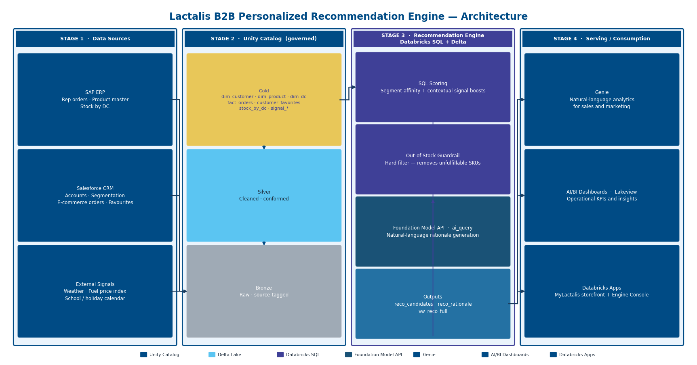
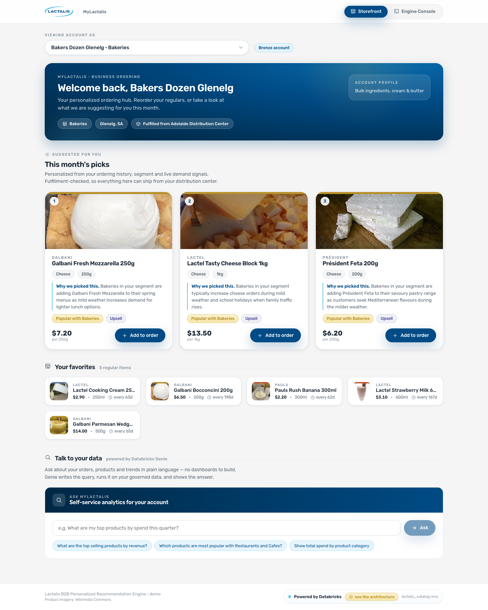
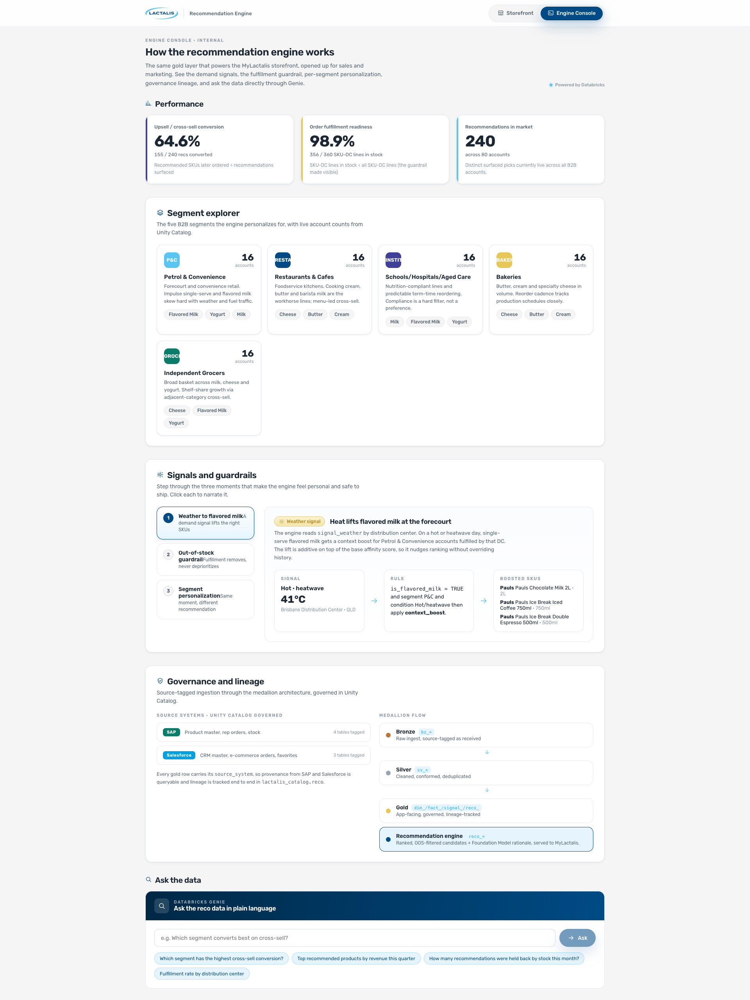
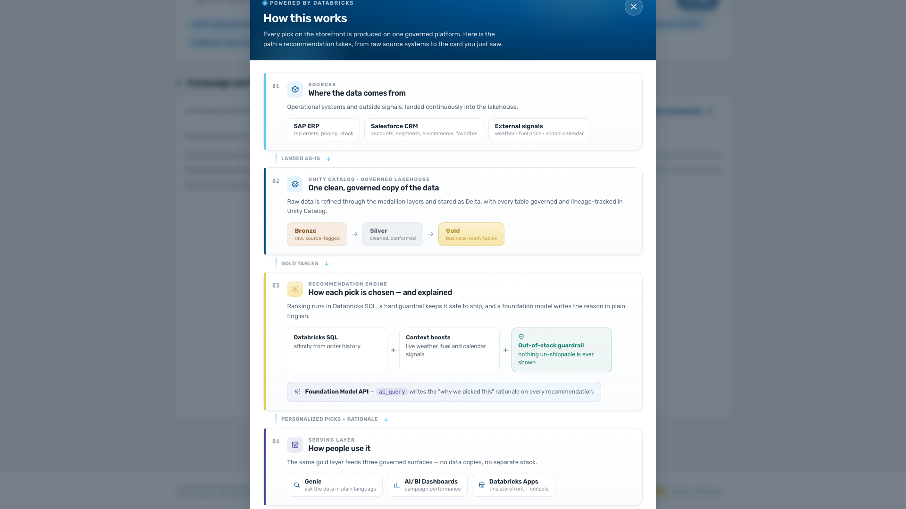
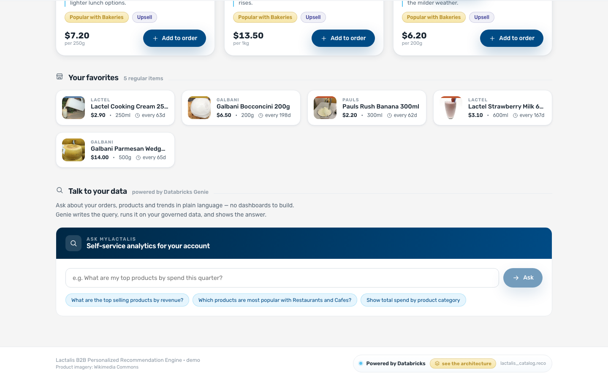

# Lactalis B2B Personalized Recommendation Engine

A Databricks demo that replaces the manual monthly "Suggested for You" spreadsheet on the
MyLactalis B2B portal with an automated, personalized, fulfilment-safe recommendation
engine, and gives the internal sales and marketing team natural-language analytics over the
results.

Built entirely on native Databricks: Unity Catalog, Delta, Databricks SQL, Foundation Model
API (`ai_query`), Genie, Metric Views, AI/BI (Lakeview) dashboards, and Databricks Apps.



## The MyLactalis storefront

The B2B customer sees their favourites plus a personalized "Suggested for You" strip, each
card with a real product image and an AI-written reason.



---

## Deploy it into your own workspace

One command builds everything: the data, the recommendation engine, the Genie space, the
dashboard, the app, and every permission the app needs. There are no manual follow-up steps.

### What you need

1. **Python 3.9 or newer** on your machine. No Node.js, nothing to compile.
   (Tested on Python 3.9, 3.10, 3.13 and 3.14.)
2. **A Databricks workspace** with a SQL warehouse, and Unity Catalog enabled.
3. **A way to sign in.** Browser sign-in is strongly recommended, because it avoids tokens
   entirely. It needs two things installed:

```
python -m pip install -r requirements.txt
```

Use `python -m pip`, not a bare `pip`. On Windows a bare `pip` often fails with
`Fatal error in launcher: Unable to create process...` because `pip.exe` has an old
Python path baked into it. Going through `python -m` sidesteps that entirely.

You also need the **Databricks CLI**, which is a standalone program, not a pip package:

| Platform | Install |
|---|---|
| Windows | `winget install Databricks.DatabricksCLI` then restart Command Prompt |
| macOS | `brew install databricks/tap/databricks` |
| Linux | `curl -fsSL https://raw.githubusercontent.com/databricks/setup-cli/main/install.sh \| sh` |

Check it with `databricks -v`; you want 0.205.0 or above. Do **not** use
`pip install databricks-cli`, which installs the deprecated legacy CLI.

Then sign in once and deploy:

```
databricks auth login --host https://your-workspace.cloud.databricks.com
python deploy.py
```

Authentication is handled by the Databricks SDK, so anything the Databricks CLI accepts
works here: browser OAuth, CLI profiles (`--profile NAME`), `DATABRICKS_HOST` /
`DATABRICKS_TOKEN` environment variables, service principals, or a personal access token.

**Is `requirements.txt` mandatory?** No. Without it the script still runs on the Python
standard library alone and prompts for a workspace URL and personal access token. But a
token only works in the workspace that issued it and is easy to truncate on paste, which
is the most common reason a deployment fails before it starts. Browser sign-in avoids
that whole class of problem, and it needs both the pip install and the CLI.

### Windows: step by step

**Step 1 - Install Python (skip if you already have it)**

Download it from [python.org/downloads](https://www.python.org/downloads/) and run the
installer. On the first screen of the installer, tick **"Add python.exe to PATH"** before
clicking Install. That checkbox is easy to miss and is the single most common cause of
"python is not recognized" later.

To confirm it worked, open **Command Prompt** (press the Windows key, type `cmd`, press
Enter) and run:

```
python --version
```

You should see something like `Python 3.13.1`.

**Step 2 - Get the code**

On the GitHub page for this repository, click the green **Code** button, then
**Download ZIP**. Save it, then right-click the downloaded file and choose
**Extract All...**. Note where you extracted it, for example
`C:\Users\yourname\Downloads\lactalis-reco-engine`.

**Step 3 - Sign in to your workspace**

Your **workspace URL** is what you see in the browser address bar when you are signed in to
Databricks, up to and including `.com`. For example:

```
https://your-company.cloud.databricks.com
```

Install the Databricks tooling. Run this from the folder you extracted in Step 2, then
restart Command Prompt so the CLI is on your PATH:

```
python -m pip install -r requirements.txt
winget install Databricks.DatabricksCLI
```

The CLI is a standalone program, so it comes from `winget`, not from pip. Confirm it
installed with `databricks -v` (you want 0.205.0 or above). If your machine has no
`winget`, use `choco install databricks-cli`, or download the Windows `.zip` from the
[Databricks CLI releases](https://github.com/databricks/cli/releases).

Now sign in. A browser window opens and you log in exactly as you normally would:

```
databricks auth login --host https://your-company.cloud.databricks.com
```

This stores the login on your machine, so you only do it once.

<details>
<summary>No CLI? Use a personal access token instead</summary>

In Databricks click your avatar in the top-right corner, then:

**Settings** > **Developer** > **Access tokens** > **Manage** > **Generate new token**

Give it any comment, leave the lifetime as-is, and click Generate. **Copy the token
immediately**, because Databricks only shows it once. It looks like `dapi1a2b3c...`.

The token must be generated **inside the same workspace URL** you give the script. A token
from a different workspace is rejected on every call.

</details>

**Step 4 - Run the deployer**

In Command Prompt, change into the extracted folder and run the script:

```
cd C:\Users\yourname\Downloads\lactalis-reco-engine
python deploy.py
```

If you signed in with `databricks auth login`, it picks that up and starts immediately. The
banner prints which sign-in it used, for example `Auth : databricks-cli`.

If you have no stored login, it asks for your workspace URL and then a token. The token is
hidden as you type or paste it. That is deliberate, it is not frozen. Press Enter and it runs.

> **Paste tip:** in Command Prompt, right-click pastes. Ctrl+V may not work.

That's it. Leave the window open until it prints the deployment summary.

### macOS and Linux

Same thing, using `python3`:

```bash
git clone https://github.com/<your-org>/lactalis-reco-engine.git
cd lactalis-reco-engine
python3 -m pip install -r requirements.txt

# The CLI is a standalone program, not a pip package
brew install databricks/tap/databricks                                                    # macOS
curl -fsSL https://raw.githubusercontent.com/databricks/setup-cli/main/install.sh | sh    # Linux

databricks auth login --host https://your-company.cloud.databricks.com
python3 deploy.py
```

### Running it without prompts

Any of these work, and none of them prompt:

```bash
# A named Databricks CLI profile
python deploy.py --profile <your-cli-profile>

# Environment variables
export DATABRICKS_HOST=https://your-company.cloud.databricks.com
export DATABRICKS_TOKEN=dapi1a2b3c...
python deploy.py

# Credentials on the command line
python deploy.py --host https://your-company.cloud.databricks.com --token dapi1a2b3c...
```

Sign-in is handled by the Databricks SDK, so a service principal configured for the SDK
(`DATABRICKS_CLIENT_ID` / `DATABRICKS_CLIENT_SECRET`) works too. The deployer prints which
method it used in the `Auth` line of the banner.

### Deploying onto an app you already created

If your team has already created the Databricks App (even an empty hello-world one) and
wants the demo to land in that app rather than a new one, name it with `--existing-app`:

```bash
python deploy.py --existing-app lactalis-recommend-engine
```

That flag changes three things:

- The app **must already exist**. If the name is wrong the deployer stops instead of
  quietly creating a second app under the typo.
- Resources already bound to the app are **kept**. The deployer adds its own
  `sql-warehouse` resource and leaves everything else alone.
- `--destroy` **will not delete the app**, because the deployer did not create it. The
  schema, job, Genie space and dashboard are still removed.

Everything else is the same: the app's own service principal is granted what it needs, the
source is uploaded, and the app is redeployed and verified over HTTP.

---

## What happens when you run it

The script prints each step as it goes and finishes with a summary. A typical run takes
**5 to 10 minutes**, most of which is the Foundation Model writing recommendation copy and
the app container starting for the first time.

| Step | What it builds |
|---|---|
| `preflight` | Checks your credentials, picks a SQL warehouse, picks an available AI model |
| `data` | Creates the catalog/schema, lands 9 CSV seeds in bronze, promotes them to silver then gold |
| `engine` | Scores recommendations, applies the out-of-stock guardrail, writes AI rationale |
| `metrics` | Creates the governed metric views |
| `pipeline` | Creates the daily job that refreshes bronze to gold and re-runs the engine |
| `genie` | Creates the Genie space over the demo tables |
| `dashboard` | Creates and publishes the AI/BI dashboard |
| `app` | Creates the Databricks App, binds its SQL warehouse, uploads the code, deploys it |
| `grants` | Gives the app's service principal access to the catalog, schema, warehouse, Genie space and dashboard |
| `verify` | Checks the data, then calls the running app over HTTP to confirm it really works |

The `verify` step is the important one. It does not just check that objects exist, it proves
the app will actually work: that the service principal's grants resolved, that the app's own
queries return rows, that every recommendation has its written rationale, and that Genie
answers a real question.

```
[   verify] Backend checks (grants, app queries, Genie)
            PASS  service principal on catalog: USE_CATALOG
            PASS  service principal on schema: SELECT, USE_SCHEMA
            PASS  customer list query: 80 accounts
            PASS  recommendation query: 240 rows in vw_reco_full
            PASS  rationale populated: 0 missing
            PASS  out-of-stock console query: 4 SKUs held back by the guardrail
            PASS  service principal on Genie space: CAN_RUN
            PASS  Genie question: answered
            PASS  service principal on dashboard: CAN_READ
```

If you deployed with a Databricks CLI profile instead of a token, the deployer can also call
the running app directly over HTTP and you get this stronger version instead:

```
[   verify] Live checks against the running app
            PASS  app health: warehouse reachable, auth oauth-m2m
            PASS  customer list: 80 accounts
            PASS  recommendations + rationale: 3 for CUST-0064, all with written rationale
            PASS  KPI tiles: 240 recs surfaced, conversion 65%
            PASS  out-of-stock console: 4 SKUs held back by the guardrail
            PASS  Genie question: answered with 5 rows
```

Both are a pass. Databricks Apps only accept OAuth tokens at their front door, so a personal
access token cannot call the app's API directly. That is a property of the platform, not a
problem with your deployment, and it has no effect on opening the app in a browser. The
deployer detects it, says so, and runs the backend checks instead.

If anything genuinely fails, the script says exactly what failed and exits with a non-zero
status. It never reports success on a half-finished deployment.

At the end you get a clickable app URL. Open it in the same browser where you are signed in
to Databricks.

**Re-running is safe.** Everything is idempotent: tables are recreated, and the app, Genie
space, dashboard and grants are updated in place rather than duplicated.

---

## What gets created in your workspace

| Object | Default name | Notes |
|---|---|---|
| Catalog | `lactalis_catalog` | Reused if it exists; see the permissions note below |
| Schema | `reco` | Bronze (`bz_*`), silver (`sv_*`) and gold tables, the engine tables, and 6 views |
| Job | `[Lactalis] Medallion Refresh` | Runs bronze to gold once a day; see below |
| Workspace folder | `<app-name>-pipeline` | The four SQL files that job runs |
| Genie space | `Lactalis Recommendation Analytics` | Over 11 tables |
| Dashboard | `Lactalis Recommendation Engine Performance` | Created and published |
| Databricks App | `lactalis-reco-engine` | Node.js/React, runs as its own service principal |

### The daily refresh

The deployment leaves behind a Databricks Job that keeps the demo moving instead of frozen at
whatever the deploy built. It runs at **08:00 Australia/Brisbane** as four chained
SQL tasks: `mutate_bronze` → `promote_medallion` → `score_reco` → `write_rationale`.

Each run nudges bronze (stock levels, weather, the fuel index), re-promotes bronze → silver →
gold, re-scores every recommendation, and rewrites the `ai_query` rationale. The changes are
deterministic from the Brisbane calendar day, so the story flips overnight: one day the
weather is mild and one set of SKUs is out of stock, the next there is a heatwave, fuel is
above average, and a different set is out of stock. See
[docs/architecture.md](docs/architecture.md) for the full table.

Nothing about the app changes: it keeps reading the same gold tables and `vw_reco_full`.
Use `--skip-job` if you would rather have a static demo.

Change any of them with `--catalog`, `--schema` and `--app-name`.

### Workspace permissions you need

The deployer needs your account to be able to:

- **Create a schema** in some catalog. It tries to create `lactalis_catalog` first. If you do
  not have `CREATE CATALOG` on the metastore (common in managed environments), it
  automatically finds a catalog you *can* write to and uses that instead, telling you which
  one it picked. Use `--catalog <name>` to choose explicitly.
- **Create a Databricks App.**
- **Create a Genie space.**
- **Use a SQL warehouse.**

The app's own service principal is granted everything it needs automatically:
`USE CATALOG`, `USE SCHEMA` + `SELECT` on the schema, `CAN_USE` on the warehouse, `CAN_RUN`
on the Genie space, and `CAN_READ` on the dashboard.

### Feature requirements

- **Unity Catalog** must be enabled.
- **Databricks Apps** must be enabled.
- **Genie** must be enabled.
- **Foundation Model APIs (pay-per-token)** are used for the recommendation rationale. The
  deployer checks which models your workspace actually has and picks the best available one,
  so it works in regions without Claude. If no chat model is available at all, re-run with
  `--no-rationale` to use rule-based rationale text instead.

---

## If something goes wrong

| What you see | What it means and what to do |
|---|---|
| `'python' is not recognized...` | Python is not on your PATH. Reinstall it and tick "Add python.exe to PATH", or use `py deploy.py` instead. |
| **Anything returning HTTP 400 or 401 on every call** | Stop troubleshooting the individual step. The credentials are being refused. The fix that works nearly always: `python -m pip install -r requirements.txt`, install the Databricks CLI (`winget install Databricks.DatabricksCLI` on Windows), then `databricks auth login --host <your-workspace-url>` and re-run `python deploy.py` with no `--host` or `--token`. |
| `Fatal error in launcher: Unable to create process using ...python.exe...` | Nothing to do with this project or with `requirements.txt`. `pip.exe` has a stale Python path baked into it, and the file it cannot find is `python.exe`. Run `python -m pip install -r requirements.txt` instead. To repair `pip` itself: `python -m pip install --upgrade --force-reinstall pip`. |
| `Could not find platform independent libraries <prefix>` | A warning from a Python install that cannot locate its own standard library, usually a moved installation or a stale `PYTHONHOME`. Check with `echo %PYTHONHOME%`; if it is set and wrong, clear it. Reinstalling Python from python.org with "Add python.exe to PATH" ticked fixes it properly. |
| `'databricks' is not recognized` | The Databricks CLI is not installed or not on your PATH. It is a standalone program, so `pip install databricks-cli` is **not** the right command (that installs the deprecated legacy CLI). Use `winget install Databricks.DatabricksCLI` on Windows, then restart Command Prompt. |
| `Databricks rejected the credentials (401)` | The token is wrong, expired, or belongs to a different workspace. Sign in with `databricks auth login` instead, or generate a fresh token in the right workspace. |
| `Databricks is refusing this token` / warehouse list returns HTTP 400 | The PAT is rejected on every call: it was created in a different workspace, or truncated/quoted on paste. A token only works in the workspace that issued it. `--user` and `--warehouse-id` will not fix this. Use `databricks auth login`. |
| `cannot configure default credentials` | The SDK found no stored login. Run `databricks auth login --host <your-workspace-url>`, or pass `--profile`, or set `DATABRICKS_HOST` and `DATABRICKS_TOKEN`. |
| `Could not authenticate with CLI profile '...'` | That profile is missing or its login expired. Re-run `databricks auth login --host <url> --profile <name>`. |
| `Could not look up your username ... Me returned 400` | Only when other APIs still work. On some brand-new workspaces SCIM Me is not ready yet. Re-run with `--user you@company.com` (your workspace login email). |
| `SQL warehouse '...' was not found` | That warehouse id does not exist in this workspace (often copied from another demo). Omit `--warehouse-id` and let the deployer pick one. |
| `Could not reach https://...` | Check the workspace URL. If you are behind a corporate proxy, set it first: `set HTTPS_PROXY=http://proxy:port` (Windows) or `export HTTPS_PROXY=...` (macOS/Linux). |
| `This workspace has no SQL warehouse` | Create one in **SQL** > **SQL Warehouses** > **Create SQL warehouse** (Serverless is recommended), then re-run. |
| `Cannot create catalog ... no CREATE CATALOG` | Not a failure. The deployer falls back to a catalog you can write to and carries on. Pass `--catalog <name>` to choose. |
| `No Databricks App named '...' exists in this workspace` | `--existing-app` only deploys onto an app that is already there. Check the spelling in **Compute** > **Apps**, or drop the flag to have the deployer create it. |
| `Could not create the Genie space` | Genie is not enabled, or you cannot create spaces. Ask an admin, or use `--skip-genie` to deploy the rest. |
| `No Foundation Model chat endpoint is available` | Pay-per-token model serving is not enabled in this workspace/region. Re-run with `--no-rationale`. |
| `App deployment finished in state FAILED` | Open **Compute** > **Apps** > your app > **Logs** in the workspace. The runtime error is there. |
| Deployment succeeded but a `verify` check failed | The summary lists which one. Re-running usually resolves transient warehouse or Genie timeouts. |

The script prints the real Databricks error rather than hiding it, so the message in the
terminal is the message to act on.

---

## Options

```
python deploy.py [options]

  (no auth flags)         Use the stored `databricks auth login` session. Recommended.
  --profile NAME          Use a named Databricks CLI profile
  --host URL              Workspace URL
  --token TOKEN           Personal access token (use with --host)
  --user EMAIL            Your workspace login email. Only needed when the automatic
                          username lookup fails (GET .../scim/v2/Me returns 400 on some
                          brand-new workspaces). Used to build /Workspace/Users/<you>/ paths.

  --catalog NAME          Catalog to deploy into      (default: lactalis_catalog)
  --schema NAME           Schema to deploy into       (default: reco)
  --app-name NAME         Databricks App name         (default: lactalis-reco-engine)
  --existing-app NAME     Deploy onto an app that already exists. Fails if it is not
                          there, keeps resources already bound to it, and is left
                          alone by --destroy.
  --warehouse-id ID       Specific SQL warehouse      (default: auto-pick serverless)
  --model NAME            Foundation Model endpoint   (default: best available)
  --as-of YYYY-MM-DD      Demo "today" driving the contextual signals (default: auto)

  --skip-app              Build data, engine, Genie and dashboard but not the app
  --skip-genie            Do not create the Genie space
  --skip-dashboard        Do not create the dashboard
  --skip-job              Do not create the daily refresh job
  --no-rationale          Use rule-based rationale instead of calling a model
  --no-verify-app         Skip the live HTTP checks against the app
  --yes, -y               Never prompt; accept the deployer's choices
```

### Removing the demo

```bash
python deploy.py --destroy
```

This lists what it is about to delete (the app and its source folder, the refresh job and its
SQL folder, the Genie space, the dashboard, and the schema with its tables), then asks you to
type `delete` to confirm. It
never deletes a catalog, and it will not touch a Genie space or dashboard that points at a
different schema from the one you are removing. Add `--catalog` / `--schema` / `--app-name`
if you deployed with non-default names.

---

## What the demo shows

**Two views in one app:**

1. **MyLactalis Storefront** (the B2B customer experience) - a branded ordering portal showing
   a customer's favourites plus a "Suggested for You" strip of up to 3 personalized
   recommendations. Each card carries an AI-written reason and a "why now" context chip.
2. **Engine Console** (the internal team's view) - segment explorer, the contextual signal
   panel (weather / fuel / calendar), the out-of-stock guardrail in action, a Unity Catalog
   governance and lineage callout, an embedded Genie chat, and KPI tiles linked to the
   Lakeview dashboard.

**How recommendations are generated:**

- **Candidate scoring (SQL):** segment-category affinity + peer purchase adoption, blended
  with contextual boosts (heatwave lifts flavoured milk for Petrol & Convenience, cold snaps
  lift cream / hot beverages, restaurants get cooking cream, institutions get
  nutrition-compliant lines, high fuel index lifts single-serve impulse buys, school holidays
  lift convenience add-ons).
- **Hard out-of-stock guardrail:** any SKU below its fulfilment threshold at the customer's
  distribution centre is *removed* (not deprioritized), directly protecting the order
  fulfilment rate.
- **Favourites protection:** recommendations never repeat items the customer already reorders.
- **AI rationale (Foundation Model API):** `ai_query` writes the one-line "why we picked this"
  copy per recommendation, precomputed at deploy time so the live demo is fast and
  deterministic.

**Segments and data.** Five B2B segments, 80 accounts, a realistic Lactalis Australia SKU
catalogue (Pauls, Président, Galbani, Lactel, Parmalat, Siggi's), 12 months of orders,
favourites, stock by DC, and weather / fuel / calendar signals. Source-tagged to SAP (ERP) and
Salesforce (CRM and e-commerce) to tell the Unity Catalog lineage story.

All data is synthetic. There is no live SAP or Salesforce integration.

## Inside the app

**Engine Console (internal view)** - conversion and fulfilment KPIs, the five B2B segments,
the contextual signal and out-of-stock guardrail walkthrough, and Unity Catalog governance
and lineage across SAP and Salesforce.



**Behind the scenes** - a "Powered by Databricks" footer opens an architecture view over the
app, without navigating away.



**Talk to your data** - Genie answers natural-language questions on the governed data, right
inside the storefront.



---

## Local development

Only needed if you want to change the UI. The deployed app does not build anything. The
React bundle in `app/frontend/dist` is committed and shipped as-is.

```bash
cd app
npm install
npm run build:frontend        # rebuild frontend/dist after changing the UI

DATABRICKS_HOST=https://your-company.cloud.databricks.com \
DATABRICKS_TOKEN=dapi... \
DATABRICKS_WAREHOUSE_ID=<id> \
RECO_CATALOG=lactalis_catalog RECO_SCHEMA=reco \
GENIE_SPACE_ID=<id> DASHBOARD_ID=<id> \
  node server/index.js
# open http://localhost:8000
```

Re-run `python deploy.py` afterwards to push the rebuilt frontend.

### App environment variables

| Variable | Required | Purpose |
|---|---|---|
| `DATABRICKS_HOST` | prod (injected) | workspace URL |
| `DATABRICKS_CLIENT_ID` / `DATABRICKS_CLIENT_SECRET` | prod (injected) | service-principal OAuth (M2M) |
| `DATABRICKS_TOKEN` or `DATABRICKS_CONFIG_PROFILE` | local | local auth |
| `DATABRICKS_WAREHOUSE_ID` | yes | SQL warehouse (bound via the `sql-warehouse` app resource in prod) |
| `RECO_CATALOG` / `RECO_SCHEMA` | yes | Unity Catalog location |
| `GENIE_SPACE_ID` | optional | enables the embedded Genie panel |
| `DASHBOARD_ID` | optional | enables the embedded Lakeview dashboard |

`/api/health` reports any missing configuration under `config_problems`.

---

## Project layout

```
lactalis-reco-engine/
  deploy.py              one-shot end-to-end deployer (stdlib + databricks-sdk for auth)
  requirements.txt       deployer dependencies
  deploy_seed/           seed data (CSV) the deployer loads
  app/                   Node.js/Express + React (Vite) dual-view app
    server/              Express backend (SQL, auth, Genie, routes)
    frontend/dist/       pre-built React bundle, shipped as-is
    app.yaml             template; deploy.py generates the real one
  dashboard/             Lakeview dashboard definition
  docs/                  design doc, schema contract, architecture
```
